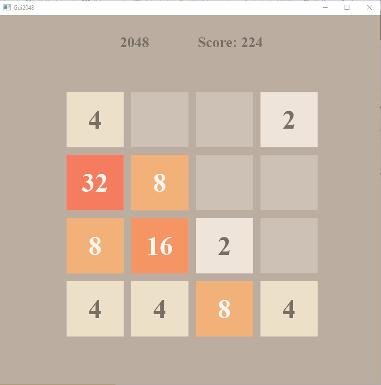
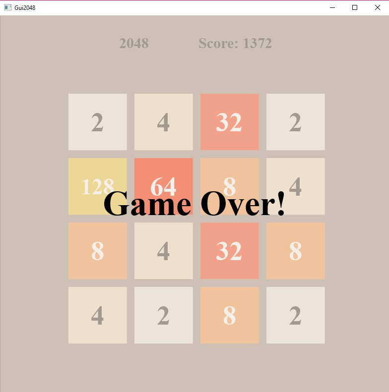

# 2048
This is a recreation of the famous app store game 2048 by Gabriele Cirulli done in a Java programming class at UC San Diego. 
The goal of the game is to slide around tile pieces with values on them on a 4x4 board and combine them until the value 2048 is reached.
If no more moves are possible, the game will end.

## Development:
The code was developed in Java using a tiered-layered design, with a master class called *GameManager* that called on other classes such 
as *Gui2048* and *Board* to control the game movements and interface. The GUI was developed using JavaFX.

### Game Mechanics:
The class in charge of the game movement is *Board*. This class contains all basic movements and instructions to end the game.
To implement movement in the game, many methods were used to first check if there were any possible moves and in what direction the 
possible move was, and from there the user would be allowed to make a move in the game. The algorithm to move a tile completely in a 
single direction was a three step process in which all numbered tiles were pushed the furthest they could go. Next, any tiles that were
of the same value were combined into a single tile of double the value, and the final step was to further push the numbered tiles until 
they couldn't move anymore. Through this process, the illusion of tiles combining and being swiped all the way in a single direction 
was achieved.

### Interface:
To implement the user interface, we used JavaFX and imported many premade classes to achieve a similar look to the original game. We used
classes to control the score, the title of the game, and the tile pieces on the board. After every move, the board is refreshed and all 
values are updated, along with the color of the tiles if they changed values. An additional feature I added to the program was the 
ability to resize the game board if the user wanted to; so all objects were set in relation to the width and height of the window.

